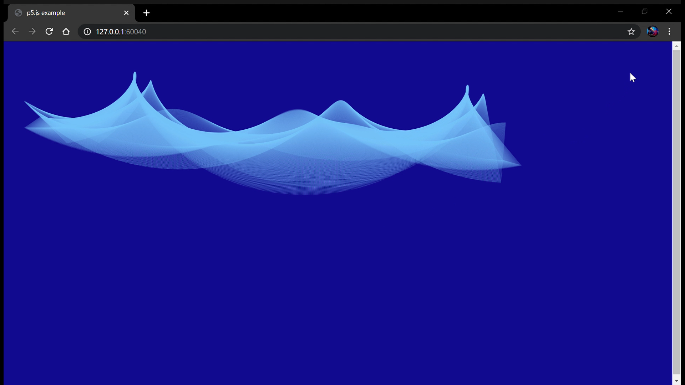
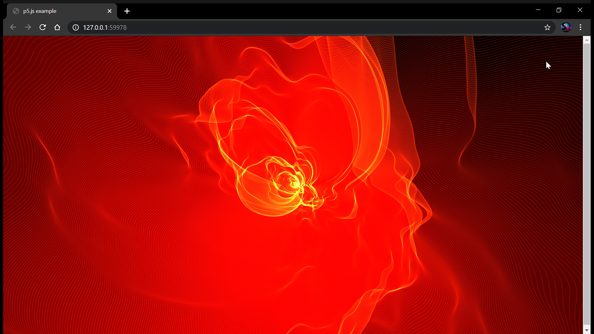
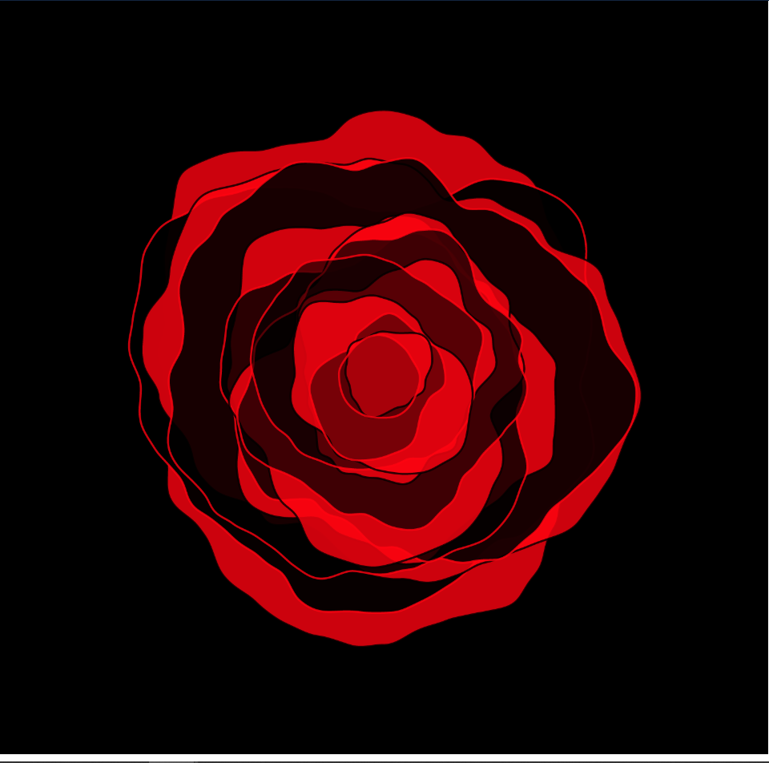
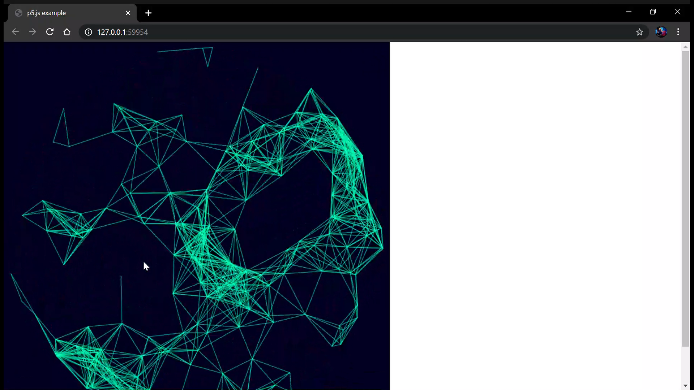
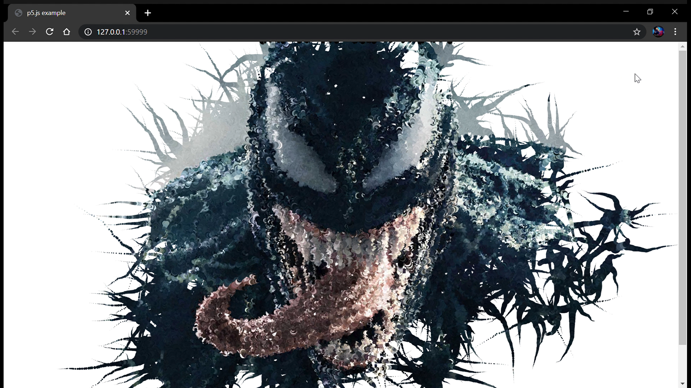
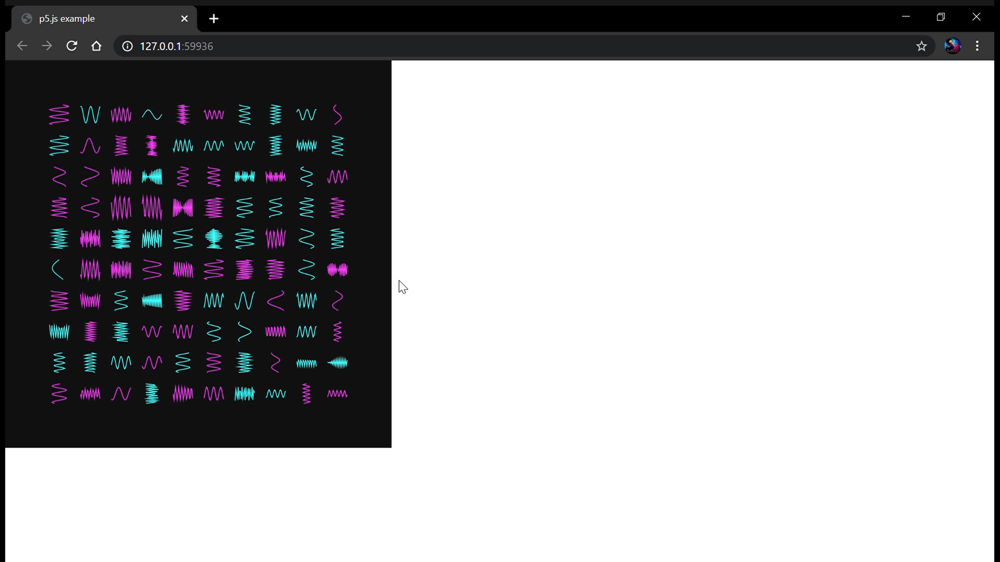
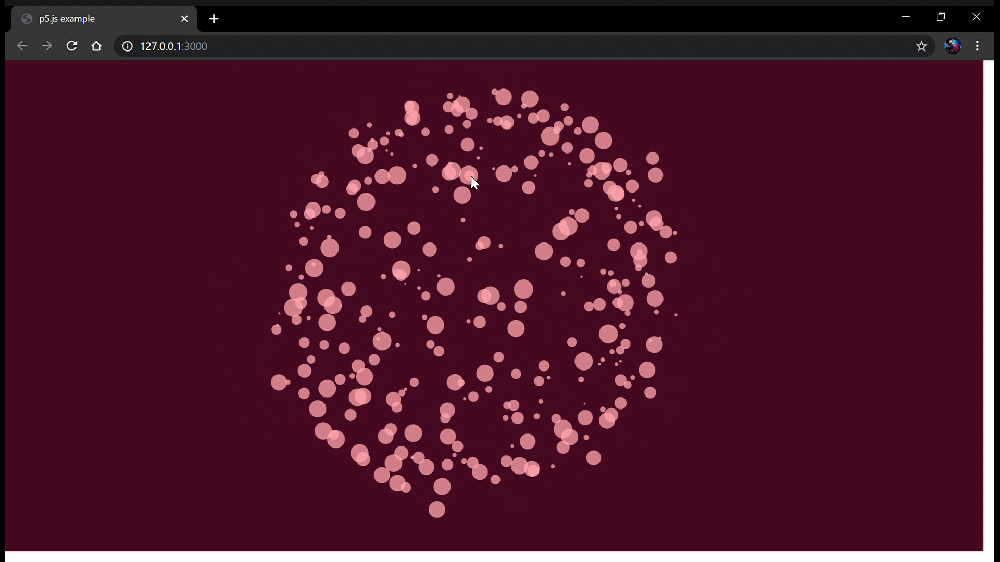

# Creative_Coding
## Some amazing visual outputs

#### 1.PERFECT BLUE
Three triangles rotating to give a unique pattern

#### 2.FLARE
This produces some unique design from solar flares

#### 3.ROSE
It has a beautiful red rose in motion

#### 4.STARS
This code gives different patterns from interlinked stars as you move the cursor through them

#### 5.VENOM
This one creates a small bubble of the color of the pixel that is supposed to be there with a decreasing readius to produce some amazing result

#### 6.WAVES
It shows different under motion sin waves with different band width and wavelengths and are of different colors

#### 7.WOBBLY
This code creates bubbles from your mouse pointer which follows laws of gravitation againsst one another to produce some amazing output

